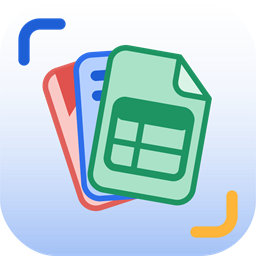

  

<h1 align="center">FileStudio</h1>

  <strong>View spreadsheets, documents and presentations right inside VS Code.</strong> 
  Fast, local and private. No office suite needed.

---

## Supported formats

| Spreadsheets | Documents | Presentations |
| --- | --- | --- |
| `.xlsx` `.csv` `.tsv` `.psv` `.ssv` | `.docx` `.pdf` `.md` | `.pptx` |

> **0.1.0 is view-only.** Editing arrives in 0.2.0.

## Highlights

- **Spreadsheets** — Excel-like grid with real formatting, frozen panes, sheet tabs, formula bar and Sum/Avg/Count. Smooth even with 100,000 rows.
- **CSV / TSV / PSV / SSV** — delimiter detected automatically; stays in sync with the text editor.
- **PDF** — zoom, outline, find (Ctrl+F) and selectable text.
- **PowerPoint** — slide thumbnails, speaker notes, tables and charts.
- **Word** — clean page view with tables, images and links.
- **Markdown** — GitHub-style preview with math, Mermaid diagrams and clickable task lists.
- Follows your VS Code theme and works with the keyboard and screen readers.

  
  

## Getting started

1. Install **FileStudio** from the Extensions view (or `code --install-extension filestudio-0.1.0.vsix`).
2. Open any supported file — it opens in FileStudio automatically.
3. Right-click a file → **Open with FileStudio** for Markdown, or **Reopen as Text** to see the raw text.

Requires VS Code 1.90 or later.

## Privacy

Everything runs locally. No telemetry, no uploads. Links open only when you click them.

## Known limitations

- View-only for now.
- Very large `.xlsx` files load slowly.
- Charts and pivot tables in `.xlsx`, and video/animations in `.pptx`, are not shown yet.
- `.docx` shows the content, not the exact Word layout.

See the [issues](https://github.com/yokeeswaran-dev/vscode-filestudio/issues) for more, or to report a bug.

## Roadmap

**0.1.x** fixes · **0.2.0** editing · **0.2.x** editing polish · **1.0.0** stable

## Contributing & license

Contributions are welcome — see [CONTRIBUTING.md](CONTRIBUTING.md).
Released under the [MIT License](LICENSE). Third-party licences: [THIRD_PARTY_NOTICES.md](THIRD_PARTY_NOTICES.md).
