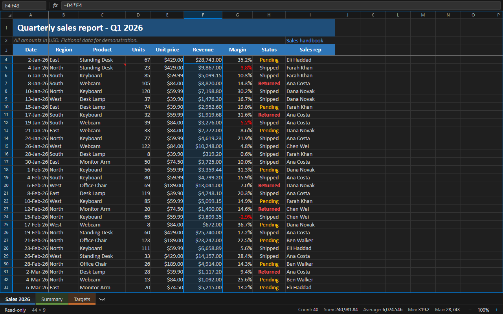
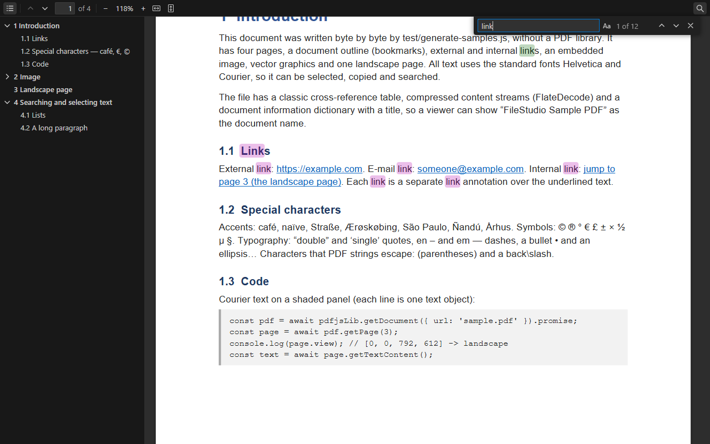
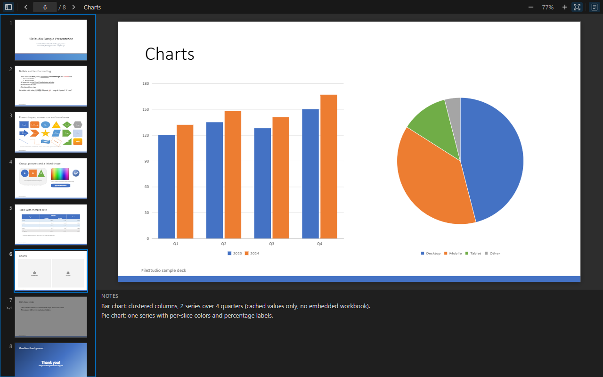

# FileStudio – Excel, CSV, Word, PDF & PowerPoint Viewer for VS Code

**Open `.xlsx`, `.csv`, `.docx`, `.pdf`, `.pptx` and `.md` files right inside VS Code.**
No Microsoft Office, no LibreOffice, no browser: click the file and read it next to your code.

⚡ Fast · 🔒 Offline and private · 🎨 Follows your VS Code theme · ⌨️ Keyboard and screen-reader friendly

---

## 📂 Supported files

| | Format | File types |
| --- | --- | --- |
| 📊 | **Excel spreadsheets** | `.xlsx` |
| 🧾 | **CSV and delimited text** | `.csv` `.tsv` `.psv` `.ssv` |
| 📄 | **Word documents** | `.docx` |
| 📕 | **PDF documents** | `.pdf` |
| 📽️ | **PowerPoint presentations** | `.pptx` `.pptm` `.ppsx` `.ppsm` `.potx` `.potm` |
| 📝 | **Markdown** | `.md` `.markdown` |

> **0.1.x is a viewer.** Editing arrives in 0.2.0.

## ✨ Features

### 📊 Excel / XLSX viewer
- Excel-like grid with the workbook's **fonts, colours, borders, number formats** and merged cells.
- **Sheet tabs**, frozen panes, hidden rows, columns and sheets, comments and links.
- **Formula bar** and status bar with **Sum, Average, Count, Min and Max**, as in Excel.
- Copy cells and paste them into Excel. Smooth scrolling, even with **100,000 rows**.

### 🧾 CSV / TSV viewer
- Comma, semicolon, tab, pipe or space: the **delimiter is detected automatically** (Excel's `sep=` line too).
- Stays in sync while you edit the file as text. **FileStudio: Change Delimiter** picks another one.

### 📄 Word / DOCX viewer
- Clean reading view with headings, lists, **tables, images** and links.

### 📕 PDF viewer
- **Zoom**, fit width or page, page navigation, **outline** (bookmarks) and **Find** (Ctrl+F, F3).
- Selectable, copyable text and clickable links.

### 📽️ PowerPoint / PPTX viewer
- **Slides** with text, shapes, pictures, **tables and charts**.
- Slide thumbnails, **speaker notes** and hidden slides.

### 📝 Markdown preview
- GitHub-style preview with **math (KaTeX)**, **Mermaid diagrams**, code highlighting and clickable task lists.

### 🔀 Works with Git
- **Open Changes** shows the old and the new version of a workbook, document, PDF or presentation side by side.

  
  

## 🚀 Getting started

1. Install **FileStudio** from the Extensions view (search for *FileStudio*, *Excel viewer* or *PDF viewer*).
2. **Click any supported file.** It opens in FileStudio.
3. Markdown opens as text by default: right-click it → **Open with FileStudio**. The **Reopen as Text** button in
   the editor title bar shows the raw text of a CSV or Markdown file.

Requires VS Code 1.123 or later. If you used the earlier **File Viewer** extension (`Yokeeswaran.file-viewer`),
uninstall it, so that it does not open the files instead of FileStudio.

## ❓ FAQ

**How do I open an Excel (`.xlsx`) file in VS Code?**
Install FileStudio and click the file. The workbook opens in a spreadsheet grid.

**Can I view PDF, Word (`.docx`) and PowerPoint (`.pptx`) files in VS Code?**
Yes, all three open in FileStudio, without Microsoft Office.

**Does it open the old `.doc`, `.xls` or `.ppt` formats?**
Not yet. Save them as `.docx`, `.xlsx` or `.pptx` first.

**Can I edit the files?**
Not yet: 0.1.x only shows files (Markdown task checkboxes can be ticked). Editing is planned for 0.2.0.

**Is my file uploaded anywhere?**
No. Everything runs on your computer: no telemetry, no uploads. Links open only when you click them.

## ⚠️ Known limitations

- Very large `.xlsx` files take a while to open.
- Charts and pivot tables in `.xlsx`, and video and animations in `.pptx`, are not shown yet.
- `.docx` shows the content, not the exact Word page layout.

See the [issues](https://github.com/yokeeswaran-dev/vscode-filestudio/issues) for more, or to report a bug.

## 🗺️ Roadmap

**0.1.x** viewer fixes · **0.2.0** editing · **0.2.x** editing polish · **1.0.0** stable

## 🤝 Contributing & license

Contributions are welcome: see [CONTRIBUTING.md](CONTRIBUTING.md).
Released under the [MIT License](LICENSE). Third-party licences: [THIRD_PARTY_NOTICES.md](THIRD_PARTY_NOTICES.md).

Microsoft, Excel, Word and PowerPoint are trademarks of Microsoft Corporation. FileStudio is an independent
open-source project and is not affiliated with Microsoft.
