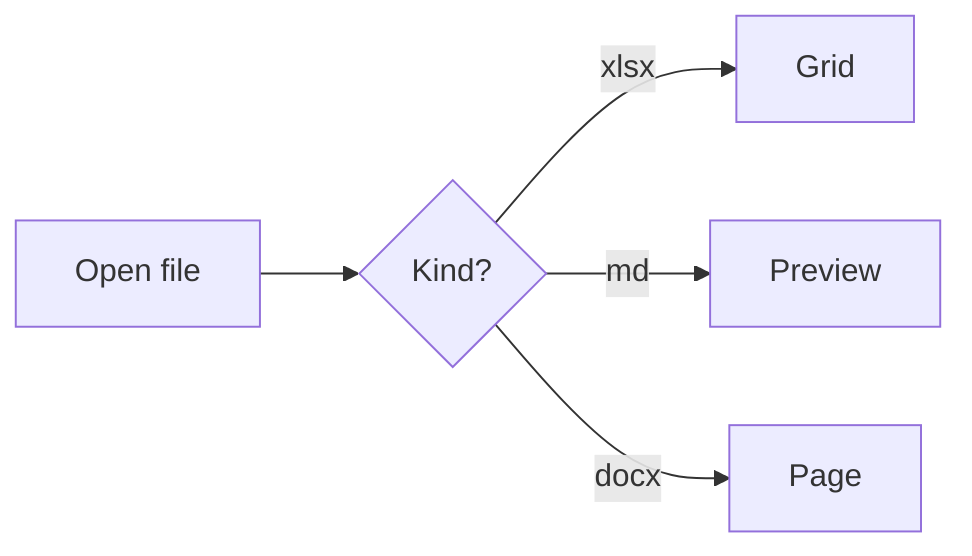
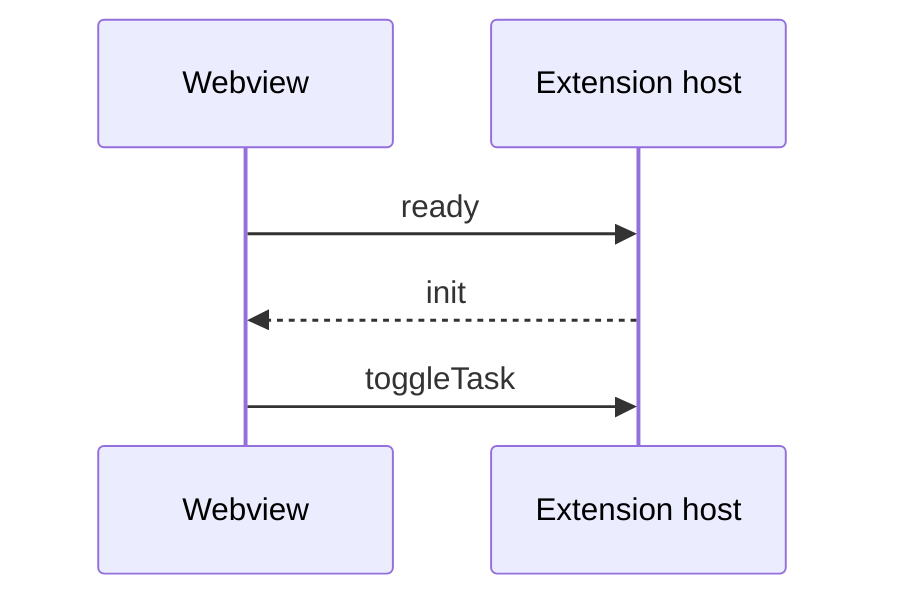

# Kitchen Sink

This document exercises every feature of the Markdown preview. Jump to the
[task lists](#task-lists), the [math section](#math), or the [alerts](#github-alerts).

## Table of contents

1. [Headings](#headings)
2. [Text formatting](#text-formatting)
3. [Links and images](#links-and-images)
4. [Lists](#lists)
5. [Task lists](#task-lists)
6. [Tables](#tables)
7. [Code](#code)
8. [Math](#math)
9. [Diagrams](#diagrams)
10. [Footnotes](#footnotes)
11. [Emoji](#emoji)
12. [GitHub alerts](#github-alerts)
13. [Raw HTML](#raw-html)
14. [Blockquotes](#blockquotes)

## Headings

# Heading level 1
## Heading level 2
### Heading level 3
#### Heading level 4
##### Heading level 5
###### Heading level 6

Setext heading level 1
======================

Setext heading level 2
----------------------

### Duplicate heading

### Duplicate heading

### Heading with `code`, *emphasis* & punctuation!

## Text formatting

Plain text with **bold**, __also bold__, *italic*, _also italic_, ***bold italic***,
~~strikethrough~~, `inline code`, and a mix: **bold with `code` and *italic* inside**.

Escaped characters: \*not italic\*, \`not code\`, \# not a heading, \$ not math.

Line breaks: this line ends with two spaces  
so this text starts on a new line, and this one ends with a backslash\
so this text also starts on a new line.

A soft line break
continues the same paragraph.

## Links and images

- External link: [VS Code](https://code.visualstudio.com "Visual Studio Code")
- Autolink: <https://github.com>
- Bare URL (linkified): https://example.com/path?query=1
- Bare www link: www.example.org
- Email: <hello@example.com>
- In-page anchor: [jump to Tables](#tables)
- Relative file: [the other file](other.md)
- Relative file with section: [other file, section](other.md#section)
- Reference-style link: [markdown-it][mdit]
- Mentions of README.md and CHANGELOG.md stay plain text.

[mdit]: https://github.com/markdown-it/markdown-it

Relative image:


Image with a remote URL (blocked offline, still rendered as an img tag):


## Lists

Unordered, nested:

- Fruit
  - Apples
    - Granny Smith
    - Honeycrisp
  - Oranges
- Vegetables
  * Carrots
  * Peas

Ordered, nested, starting at 3:

3. Third
4. Fourth
   1. Fourth, part one
   2. Fourth, part two
      - mixed bullet inside
5. Fifth

Loose list with paragraphs:

- First item paragraph.

  Second paragraph of the first item.

- Second item.

## Task lists

- [x] Write the renderer
- [ ] Write the tests
  - [x] Front matter
  - [ ] Math heuristics
    - [ ] Deeply nested task
- [X] Uppercase X also counts as done
- Regular item in the same list

1. [ ] Ordered task one
2. [x] Ordered task two

## Tables

| Left aligned | Centered | Right aligned | Default |
| :----------- | :------: | ------------: | ------- |
| apples       |    10    |         $1.25 | red     |
| bananas      |   200    |        $12.00 | yellow  |
| `code` cell  | **bold** |   *italic* 42 | [link](#tables) |

| Single column |
| ------------- |
| one row       |

## Code

Inline: `const x = 1;`

```ts
// TypeScript
interface User {
  id: number;
  name: string;
}

export function greet(user: User): string {
  return `Hello, ${user.name}!`;
}
```

```js
// JavaScript
const items = [1, 2, 3].map((n) => n * 2);
console.log(items.join(', '));
```

```python
# Python
def fib(n: int) -> int:
    """Return the n-th Fibonacci number."""
    return n if n < 2 else fib(n - 1) + fib(n - 2)

print([fib(i) for i in range(10)])
```

```json
{
  "name": "filestudio",
  "version": "0.1.0",
  "private": true,
  "keywords": ["xlsx", "csv", "markdown"]
}
```

```bash
#!/usr/bin/env bash
set -euo pipefail
for f in *.md; do
  echo "Rendering $f"
done
```

```diff
- const old = 'removed';
+ const updated = 'added';
  unchanged line
```

```
Unlabeled code block: no highlighting.
<b>HTML stays escaped</b> & so do ampersands.
```

```made-up-language
An unknown language is escaped, not highlighted: <tag>
```

    Indented code block (four spaces).
    Second line.

## Math

Inline math: $E = mc^2$, $\alpha + \beta = \gamma$, and $\sum_{i=1}^{n} i = \frac{n(n+1)}{2}$.

Prices are not math: it costs $5 and $10 for two.

An escaped dollar \$x\$ is not math either.

Block math:

$$
\int_{-\infty}^{\infty} e^{-x^2}\,dx = \sqrt{\pi}
$$

Single-line block math:

$$ a^2 + b^2 = c^2 $$

Math fence:

```math
\begin{pmatrix} a & b \\ c & d \end{pmatrix}
```

Invalid TeX renders as an inline error: $\frac{1}{$.

## Diagrams

Flowchart:



Sequence diagram:



Intentionally invalid diagram (must show a readable error):

```mermaid
flowchart TD
  A --> B -->
  this is not valid mermaid ((((
```

## Footnotes

Here is a footnote reference[^1], another one[^note], and an inline footnote^[Inline footnotes work too.].

[^1]: The first footnote.
[^note]: A named footnote with **formatting** and `code`.

## Emoji

Shortcodes: :tada: :rocket: :+1: :smile: :warning: :heart:

Text emoticons stay as typed: :-) ;) 8)

## GitHub alerts

> [!NOTE]
> Useful information that users should know, even when skimming content.

> [!TIP]
> Helpful advice for doing things better or more easily.

> [!IMPORTANT]
> Key information users need to know to achieve their goal.

> [!WARNING]
> Urgent info that needs immediate user attention to avoid problems.

> [!CAUTION]
> Advises about risks or negative outcomes of certain actions.
>
> A second paragraph inside the caution alert.

## Raw HTML

<details>
<summary>Click to expand</summary>

Hidden **markdown** content inside a details element.

</details>

Press <kbd>Ctrl</kbd> + <kbd>Shift</kbd> + <kbd>P</kbd> to open the command palette.

<p align="center">
  
</p>

<!-- An HTML comment is not rendered. -->

## Blockquotes

> A simple blockquote.
>
> > A nested blockquote.
>
> Back to the outer level, with a list:
>
> - one
> - two

---

***

## Long paragraph

Lorem ipsum dolor sit amet, consectetur adipiscing elit, sed do eiusmod tempor incididunt ut labore et dolore magna aliqua. Ut enim ad minim veniam, quis nostrud exercitation ullamco laboris nisi ut aliquip ex ea commodo consequat. Duis aute irure dolor in reprehenderit in voluptate velit esse cillum dolore eu fugiat nulla pariatur. Excepteur sint occaecat cupidatat non proident, sunt in culpa qui officia deserunt mollit anim id est laborum. Sed ut perspiciatis unde omnis iste natus error sit voluptatem accusantium doloremque laudantium, totam rem aperiam, eaque ipsa quae ab illo inventore veritatis et quasi architecto beatae vitae dicta sunt explicabo. Nemo enim ipsam voluptatem quia voluptas sit aspernatur aut odit aut fugit, sed quia consequuntur magni dolores eos qui ratione voluptatem sequi nesciunt. Neque porro quisquam est, qui dolorem ipsum quia dolor sit amet, consectetur, adipisci velit, sed quia non numquam eius modi tempora incidunt ut labore et dolore magnam aliquam quaerat voluptatem.

The end.
